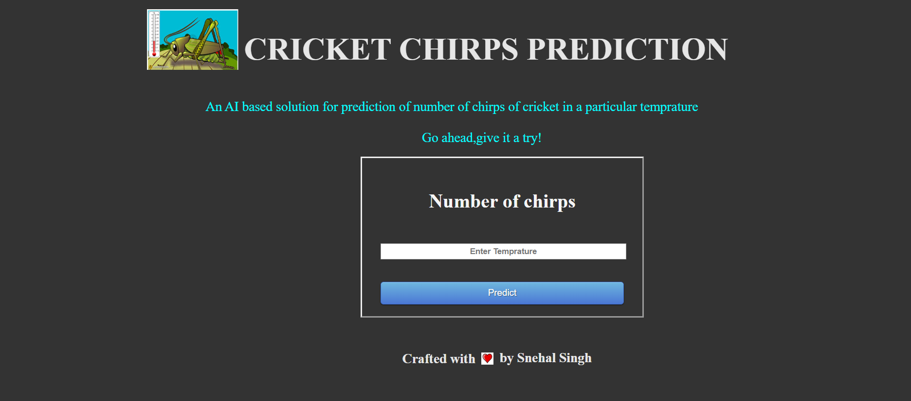
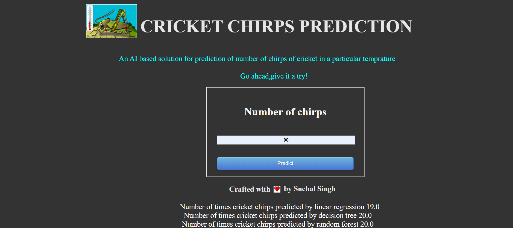

# Cricket-Chirps-Prediction
Using Linear Regression, Decision Tree and Random Forest Algorithm

A Machine Learning project to count the number of times an insect called 'Cricket' chirps in a specified temprature.
In this i have implemented three regression algorithm Linear Regression, Decision tree and Random Forest.
  
WHY DO CRICKETS CHIRP?

So, how and why do crickets make that chirping sound, anyway? Chirping is a cricket’s way of communicating. Male crickets use chirping to attract females, scare off other males, or warn of danger.

Contrary to popular belief, crickets do not use their legs to chirp! In fact, crickets produce the iconic sound by rubbing the edges of their wings together. The male cricket rubs a scraper (a sharp ridge on his wing) against a series of wrinkles, or “files”, on the other wing. The tone of the chirping depends upon the distance between the wrinkles.

There are several reasons why crickets chirp. They may be:

Calling to attract a female with a a loud and monotonous sound
Courting a nearby female with a quick, softer chirp
Behaving aggressively during the encounter of two males
Sounding a danger alert when sensing trouble
Crickets are part of the family Orthoptera (grasshoppers and katydids).

# Project

# Prediction

